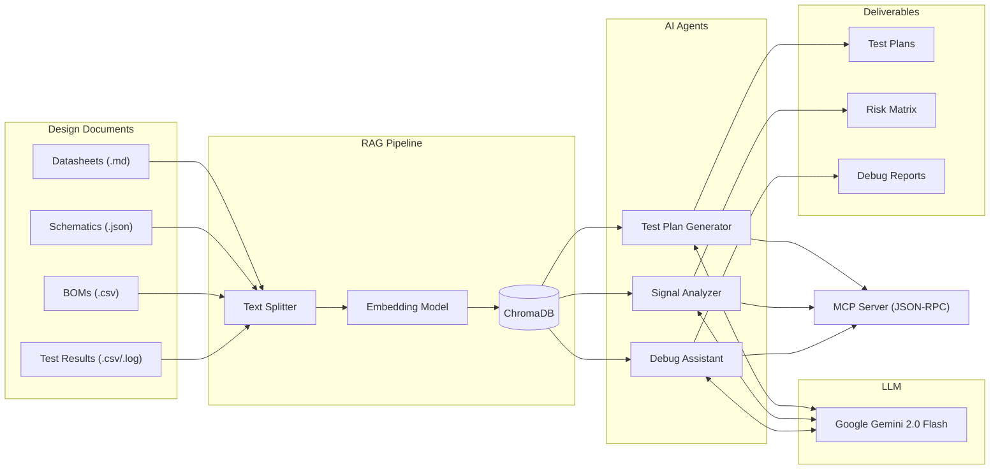

# MoogTestAI


AI-powered assistant for card-level and box-level hardware testing and debugging. Built as part of the Moog India Technology Center internship assignment.

The idea is simple — instead of manually writing test plans and debugging boards from scratch every time, this tool ingests your design documents (datasheets, schematics, BOMs) and uses a RAG pipeline + LLM to generate test procedures, flag risky components, and help you figure out why a board failed.

## Architecture



## What it does

1. **Test Plan Generation** — Feed it a servo amplifier datasheet and it generates structured test procedures covering functional, boundary, communication, environmental, and protection tests. Each test has specific pass/fail values pulled from the actual datasheet specs.

2. **Critical Signal & Failure Analysis** — Parses the schematic and BOM to find which signals and components are most likely to cause problems. Outputs an FMEA-style risk matrix sorted by priority.

3. **Debug Assistant** — Give it a test results CSV (or describe symptoms in plain English) and it cross-references the design specs to tell you what probably went wrong and what to probe next.

4. **MCP Server** — All tools are exposed via Anthropic's Model Context Protocol, so you can plug this into Claude Desktop or any MCP-compatible host.

## Tech Stack

| Component | Technology | Why I picked it |
|---|---|---|
| Language | Python 3.11+ | Required for the assignment, plus it has the best AI/ML ecosystem |
| LLM | Google Gemini 2.0 Flash | Free tier, multimodal, good reasoning |
| RAG | LangChain + ChromaDB | Industry standard for document-grounded AI. ChromaDB runs locally so no cloud dependency |
| Doc Parsing | PyMuPDF + Pandas | Handles PDFs, CSVs, and structured JSON |
| MCP | mcp Python SDK | Anthropic's official protocol for tool interop |
| CLI | Typer + Rich | Gives a nice looking terminal UI for demos |
| Testing | pytest | Standard Python testing |

## How to run

### Prerequisites
- Python 3.11+
- A free Google Gemini API key from [Google AI Studio](https://aistudio.google.com/)

### Setup

```bash
git clone https://github.com/22MIS1157/moog-test-ai.git
cd moog-test-ai

# create virtual env
python -m venv venv
venv\Scripts\activate          # windows
# source venv/bin/activate     # mac/linux

# install deps
pip install -r requirements.txt
```

### Configure API key

```bash
copy .env.example .env
# open .env and paste your Gemini API key
```

### Ingest the design documents

```bash
python -m src.rag.ingest
```

This reads everything from `data/pilot_design/` and `data/test_results/`, chunks it, embeds it, and stores it in ChromaDB locally.

### Run the CLI

```bash
python -m src.cli
```

You'll get an interactive menu:
```
1. Ingest Design Documents
2. Generate Test Plan
3. Analyze Critical Signals & Failure Points
4. Debug Test Results — Automatic Analysis
5. Debug Test Results — Interactive Mode
6. List Available Test Files
0. Exit
```

### Run the MCP Server

```bash
python -m src.mcp_server.server
```

To connect from Claude Desktop, add this to `claude_desktop_config.json`:
```json
{
  "mcpServers": {
    "moog-test-ai": {
      "command": "python",
      "args": ["-m", "src.mcp_server.server"],
      "cwd": "C:/path/to/moog-test-ai"
    }
  }
}
```

### Run tests

```bash
pytest tests/ -v
```

## Project Structure

```
moog-test-ai/
├── README.md
├── requirements.txt
├── .env.example
├── .gitignore
├── data/
│   ├── pilot_design/
│   │   ├── servo_amplifier_datasheet.md
│   │   ├── power_supply_schematic.json
│   │   └── bom.csv
│   └── test_results/
│       ├── card_test_pass.csv
│       ├── card_test_fail_overcurrent.csv
│       └── box_test_emi_failure.log
├── src/
│   ├── config.py
│   ├── cli.py
│   ├── rag/
│   │   ├── ingest.py
│   │   └── retriever.py
│   ├── agents/
│   │   ├── test_plan_agent.py
│   │   ├── signal_analyzer_agent.py
│   │   └── debug_agent.py
│   └── mcp_server/
│       └── server.py
├── docs/
│   ├── tool_survey.md
│   ├── pilot_design.md
│   └── process_report.md
└── tests/
    ├── test_rag_pipeline.py
    ├── test_agents.py
    └── test_mcp_server.py
```

## Pilot Design

I picked a **Servo Amplifier Control Card (MOOG-SA-4200)** as the pilot design because it's representative of Moog's core product line — converts low-power digital control signals into high-power motor drive signals for BLDC motors. It has enough complexity (power stage, gate drivers, current sensing, SPI/EtherCAT comms, thermal protection) to properly demonstrate the AI assistant's capabilities.

Full details in [docs/pilot_design.md](docs/pilot_design.md).

## Tool Survey

I evaluated 8 tools including Flux Copilot, GitHub Copilot, GPT-4o, Gemini, and others before deciding on a custom RAG pipeline with MCP. The main reason: off-the-shelf tools don't understand proprietary hardware designs. A custom RAG system lets us ingest Moog's actual datasheets and schematics so the AI's answers are grounded in the real specs, not generic knowledge.

Full comparison in [docs/tool_survey.md](docs/tool_survey.md).

## What I'd improve with more time

- **Redis caching** for LLM responses to reduce latency on repeated queries
- **Conversation memory** for multi-turn debugging sessions
- **Real instrument integration** via SCPI/VISA to actually control oscilloscopes and DMMs
- **Fine-tuned model** with a LoRA adapter trained on Moog's historical test data
- **Web UI** with Next.js for browser-based access instead of just CLI

## Documentation

- [Tool Survey](docs/tool_survey.md) — Evaluation of AI tools for hardware test automation
- [Pilot Design](docs/pilot_design.md) — Why I chose the servo amplifier and its specs
- [Process Report](docs/process_report.md) — Full methodology, architecture, results, and lessons learned

---

**Afnaan Ahmed P**
M.Tech Software Engineering, VIT Chennai Campus
